# 核心组件详解

COTA框架由多个核心组件构成，每个组件都有明确的职责和边界。本文档详细介绍各个组件的设计、实现和交互机制。

## 📋 组件总览

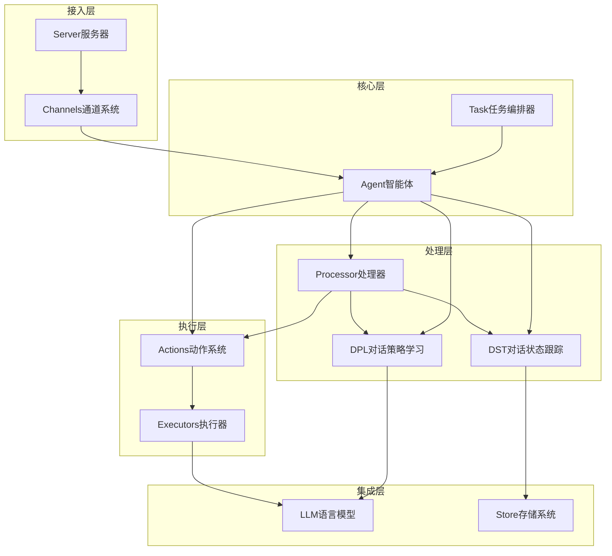

## 🤖 Agent (智能体)

Agent是COTA框架的核心组件，负责整合和协调所有其他组件。

### 核心职责

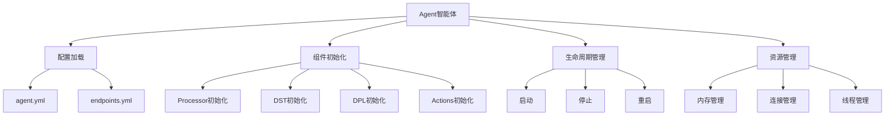

### 关键特性

**1. 配置驱动**
```python
# 从路径加载智能体
agent = Agent.load_from_path("path/to/bot")

# 配置解析和验证
agent_config = read_yaml_from_path("agent.yml")
endpoints_config = read_yaml_from_path("endpoints.yml")
```

**2. 组件管理**
```python
class Agent:
    def __init__(self):
        self.processor = Processor(agent=self, store=self.store)
        self.dpl = DPLFactory.create(agent_config, path)
        self.llms = {name: LLM(config) for name, config in llm_configs.items()}
        self._executors = {}  # 执行器字典
```

**3. 动作构建**
```python
def build_action(self, action_name: str) -> Action:
    """构建指定名称的动作实例"""
    action_config = self.actions.get(action_name, {})
    return Action.build_from_name(
        name=action_name,
        description=action_config.get("description", ""),
        prompt=action_config.get("prompt", "")
    )
```

### 扩展机制

**自定义智能体**
```python
class CustomAgent(Agent):
    def __init__(self, **kwargs):
        super().__init__(**kwargs)
        # 自定义初始化逻辑
        
    async def custom_method(self):
        # 自定义方法实现
        pass
```

## 🔄 Processor (处理器)

Processor负责消息处理和对话流程控制，是智能体的"大脑"。

### 处理流程

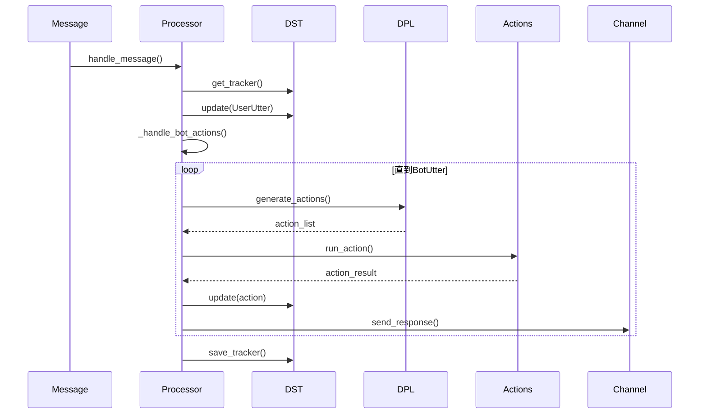

### 核心方法

**1. 消息处理**
```python
async def handle_message(self, message: Message, channel: Optional[Channel] = None):
    # 构建UserUtter动作
    action = Action.build_from_name(name='UserUtter')
    action.run_from_dict({
        "result": [message.as_dict()],
        "sender": message.sender,
        "sender_id": message.sender_id
    })
    
    # 更新对话状态
    self.dst = await self.get_tracker(message.session_id)
    self.dst.update(action)
    
    # 处理机器人动作
    await self._handle_bot_actions(message.session_id, channel)
```

**2. 动作执行循环**
```python
async def _handle_bot_actions(self, session_id: str, channel: Optional[Channel] = None):
    while True:
        # 生成下一步动作
        bot_actions = await self.agent.generate_actions(self.dst)
        
        for action_item in bot_actions:
            # 执行动作
            await action_item.run(self.agent, self.dst)
            # 更新状态
            self.dst.update(action_item)
            # 发送响应
            if channel:
                await self.execute_channel_effects(action_item, session_id, channel)
            # 检查是否结束
            if isinstance(action_item, BotUtter):
                return
```

**3. 代理用户模式**
```python
async def _handle_message_proxy(self, message: Message, channel: Optional[Channel] = None):
    # 代理用户进行多轮对话
    max_proxy_user_step = self.agent.dialogue.get('max_proxy_user_step')
    
    for i in range(max_proxy_user_step):
        # 执行查询动作
        action = self.agent.build_action('Query')
        await action.run(self.agent, self.dst, user=user)
        
        # 检查停止条件
        if action.result[0].get('text','') == '/stop':
            break
            
        # 处理响应
        await self._handle_bot_actions(message.session_id, channel)
```

## 🧠 DST (对话状态跟踪)

DST负责维护对话的完整状态和历史记录。

### 状态结构

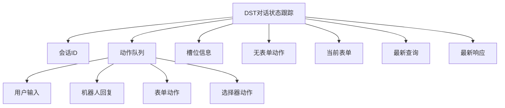

### 核心功能

**1. 状态更新**
```python
def update(self, action: Action) -> None:
    """更新对话状态"""
    action.apply_to(self)  # 将动作应用到状态
```

**2. 消息提取**
```python
def extract_messages(self) -> List[Dict[str, Any]]:
    """提取对话消息用于LLM调用"""
    messages = []
    for action in self.actions:
        if isinstance(action, UserUtter):
            messages.append({'role': 'user', 'content': action.result[0].get('text','')})
        elif isinstance(action, BotUtter):
            messages.append({'role': 'assistant', 'content': action.result[0].get('text','')})
    return messages
```

**3. 模板变量观察**
```python
def observe(self, name: str, action: Action):
    """观察模板变量值"""
    if hasattr(self, name):
        method = getattr(self, name)
        return method(action)
    else:
        raise AttributeError(f"Method {name} not found")
```

### 模板变量系统

DST提供丰富的模板变量支持：

| 变量名 | 说明 | 示例 |
|--------|------|------|
| `history_messages` | 历史消息 | "user:你好\nassistant:您好！" |
| `history_actions` | 历史动作 | "UserUtter:你好\nBotUtter:您好！" |
| `action_descriptions` | 动作描述 | "- `Weather`: 查询天气信息" |
| `current_form_name` | 当前表单名 | "Weather" |
| `current_form_slot_states` | 槽位状态 | `{"city": "北京", "time": "今天"}` |

## 🎯 DPL (对话策略学习)

DPL负责生成智能体的思维链和决策下一步动作。

### 策略类型

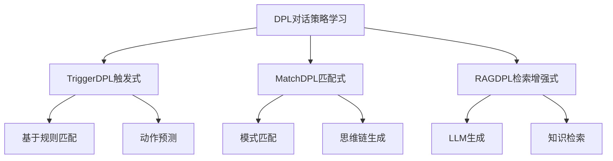

### 核心接口

**1. 基础DPL接口**
```python
class DPL:
    async def generate_thoughts(self, dst: DST, action: Action) -> Optional[str]:
        """生成思维链"""
        return None
    
    async def generate_actions(self, dst: DST) -> Optional[List[str]]:
        """生成下一步动作"""
        return None
```

**2. TriggerDPL实现**
```python
class TriggerDPL(DPL):
    async def generate_actions(self, dst: DST) -> List[str]:
        """基于触发规则生成动作"""
        actions = dst.formless_actions
        query_index = [i for i, a in enumerate(actions) if a.name == 'UserUtter']
        
        for q_index in query_index:
            segment = actions[q_index:]
            keys = self._build_action_key(segment)
            for key in keys:
                matched_actions = self.features.get(key)
                if matched_actions:
                    return matched_actions
        return None
```

**3. RAGDPL实现**
```python
class RAGDPL(DPL):
    async def generate_thoughts(self, dst: DST, action: Action) -> str:
        """使用LLM生成思维链"""
        llm_name = self.get_llm_for_action(action.name)
        query_text = self.build_rag_query(dst, action)
        
        result = await dst.agent.llm_instance(llm_name).generate_chat(
            messages=[{"role": "user", "content": query_text}],
            max_tokens=dst.agent.dialogue.get('max_tokens', DEFAULT_DIALOGUE_MAX_TOKENS)
        )
        return result["content"]
```

## ⚡ Actions (动作系统)

动作系统是COTA的执行引擎，负责处理各种具体操作。

### 动作层次结构

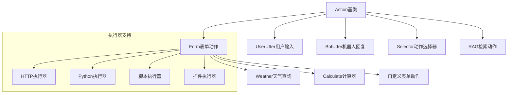

### 核心方法

**1. 动作执行**
```python
class Action:
    async def run(self, agent: Agent, dst: DST, **kwargs):
        """运行动作"""
        # 格式化提示词
        formatted_prompt = await self._format_prompt(agent, dst)
        
        # 调用LLM生成响应
        result = await self._generate_response(agent, formatted_prompt)
        
        # 处理结果
        self.result = self._process_result(result)
        
        return self
```

**2. 表单动作**
```python
class Form(Action):
    def __init__(self):
        super().__init__()
        self.slots = {}  # 槽位信息
        self.state = "start"  # 表单状态
    
    async def run(self, agent: Agent, dst: DST):
        if self.state == "start":
            # 询问缺失的槽位
            missing_slot = self._get_missing_slot()
            if missing_slot:
                await self._ask_for_slot(missing_slot, agent, dst)
            else:
                # 执行外部调用
                await self._execute_external_call(agent)
```

**3. 执行器系统**
```python
class Executor:
    async def execute(self, data: Dict[str, Any]) -> Tuple[str, Dict]:
        """执行具体操作"""
        raise NotImplementedError

class HttpExecutor(Executor):
    async def execute(self, data: Dict[str, Any]) -> Tuple[str, Dict]:
        """HTTP API调用"""
        async with aiohttp.ClientSession() as session:
            async with session.request(
                method=self.config['method'],
                url=self.config['url'],
                json=data
            ) as response:
                result = await response.json()
                return str(result), {"status": response.status}
```

## 📡 Channels (通道系统)

通道系统提供多种接入方式，支持不同的通信协议。

### 通道类型

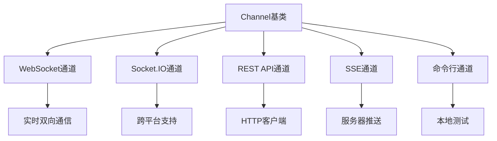

### 通道实现

**1. 基础通道接口**
```python
class Channel:
    def blueprint(self, on_new_message: Callable) -> Blueprint:
        """定义Sanic蓝图"""
        raise NotImplementedError
    
    async def send_response(self, recipient_id: str, message: Dict[str, Any]) -> None:
        """发送响应消息"""
        raise NotImplementedError
```

**2. WebSocket通道**
```python
class WebSocketChannel(Channel):
    def blueprint(self, on_new_message):
        websocket_blueprint = Blueprint("websocket_webhook")
        
        @websocket_blueprint.websocket("/ws")
        async def websocket_handler(request, ws):
            while True:
                data = await ws.recv()
                message = self.handle_message(json.loads(data))
                await on_new_message(message, self)
        
        return websocket_blueprint
```

**3. Socket.IO通道**
```python
class SocketIOChannel(Channel):
    def __init__(self):
        self.sio = AsyncServer(cors_allowed_origins="*")
    
    def blueprint(self, on_new_message):
        @self.sio.event
        async def user_uttered(sid, data):
            message = self.handle_message(data)
            await on_new_message(message, self)
```

## 🗄️ Store (存储系统)

存储系统负责持久化对话状态和历史记录。

### 存储类型

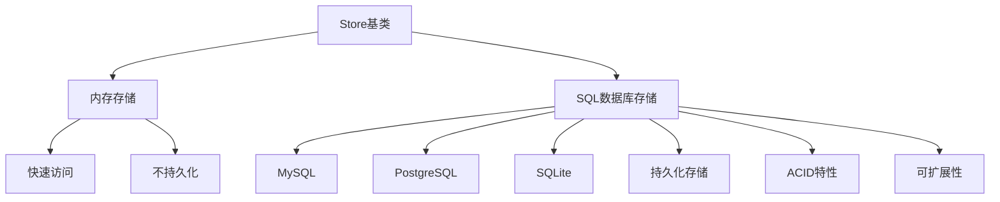

### 存储接口

**1. 基础存储接口**
```python
class Store:
    async def save(self, tracker: DST) -> None:
        """保存对话状态"""
        raise NotImplementedError
    
    async def retrieve(self, session_id: str) -> Optional[List[Dict]]:
        """检索对话历史"""
        raise NotImplementedError
    
    async def exists(self, session_id: str) -> bool:
        """检查会话是否存在"""
        raise NotImplementedError
```

**2. SQL存储实现**
```python
class SQLStore(Store):
    async def save(self, tracker: DST) -> None:
        """保存到数据库"""
        session_data = {
            'session_id': tracker.session_id,
            'actions': [action.as_dict() for action in tracker.actions],
            'slots': tracker.slots,
            'timestamp': datetime.utcnow()
        }
        
        async with self.engine.begin() as conn:
            await conn.execute(
                insert(self.conversation_table).values(**session_data)
                .on_duplicate_key_update(**session_data)
            )
```

## 🤖 LLM (语言模型集成)

LLM组件提供统一的大语言模型接口，支持多种模型服务商。

### 模型支持

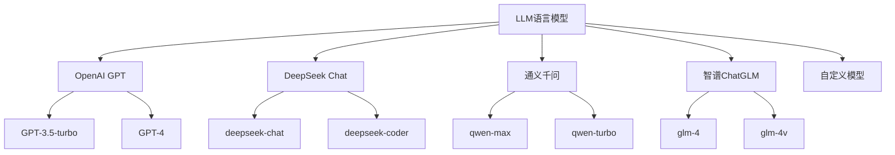

### LLM接口

**1. 统一接口**
```python
class LLM:
    async def generate_chat(
        self, 
        messages: List[Dict[str, str]], 
        max_tokens: int = 2000,
        temperature: float = 0.7,
        **kwargs
    ) -> Dict[str, Any]:
        """统一的聊天生成接口"""
        raise NotImplementedError
```

**2. 模型实现**
```python
class OpenAILLM(LLM):
    async def generate_chat(self, messages, max_tokens=2000, **kwargs):
        """OpenAI模型实现"""
        response = await self.client.chat.completions.create(
            model=self.model_name,
            messages=messages,
            max_tokens=max_tokens,
            temperature=kwargs.get('temperature', 0.7)
        )
        return {
            "content": response.choices[0].message.content,
            "usage": response.usage._asdict()
        }
```

## 🔧 Task (任务编排器)

Task组件支持多智能体协作和复杂任务编排。

### 任务架构

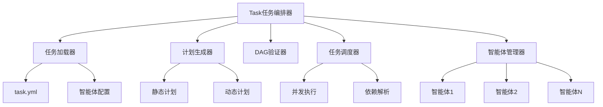

### 任务执行

**1. 任务加载**
```python
class Task:
    @classmethod
    def load_from_path(cls, path: str) -> 'Task':
        """从路径加载任务配置"""
        task_config = read_yaml_from_path(os.path.join(path, 'task.yml'))
        endpoints_config = read_yaml_from_path(os.path.join(path, 'endpoints.yml'))
        
        # 加载智能体
        agents = cls.load_agents(path, store)
        
        return cls(
            description=task_config.get("description"),
            prompt=task_config.get("prompt"),
            agents=agents,
            plans=task_config.get("plans"),
            llm=LLM(endpoints_config.get('llm', {}))
        )
```

**2. DAG执行**
```python
async def run_with_plan(self, max_concurrent_tasks: int = 5):
    """基于DAG计划执行任务"""
    # 初始化任务状态
    for plan in self.plans:
        plan['status'] = 'pending'
    
    all_tasks = {task['name']: task for task in self.plans}
    task_status = {task['name']: task['status'] for task in self.plans}
    
    # 信号量控制并发
    semaphore = asyncio.Semaphore(max_concurrent_tasks)
    
    while 'pending' in task_status.values():
        # 找到可执行的任务
        ready_tasks = []
        for task_name, status in task_status.items():
            if status == 'pending':
                dependencies = all_tasks.get(task_name).get('dependencies', [])
                if all(task_status[dep] == 'completed' for dep in dependencies):
                    ready_tasks.append(task_name)
        
        # 并发执行就绪任务
        if ready_tasks:
            tasks = [
                self.execute_task_with_semaphore(all_tasks[task_name], semaphore)
                for task_name in ready_tasks
            ]
            await asyncio.gather(*tasks)
            
            # 更新任务状态
            for task_name in ready_tasks:
                task_status[task_name] = 'completed'
```

## 🔗 组件间通信

### 消息传递

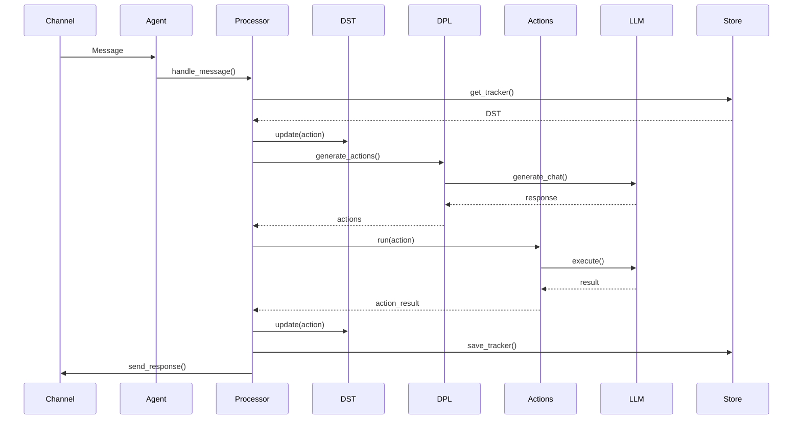

### 事件系统

COTA采用事件驱动架构，组件间通过事件进行解耦通信：

**1. 事件定义**
```python
class Event:
    def __init__(self, type: str, data: Dict[str, Any]):
        self.type = type
        self.data = data
        self.timestamp = datetime.utcnow()

class MessageReceivedEvent(Event):
    def __init__(self, message: Message):
        super().__init__("message_received", {"message": message})

class ActionExecutedEvent(Event):
    def __init__(self, action: Action):
        super().__init__("action_executed", {"action": action})
```

**2. 事件总线**
```python
class EventBus:
    def __init__(self):
        self._listeners = defaultdict(list)
    
    def subscribe(self, event_type: str, handler: Callable):
        """订阅事件"""
        self._listeners[event_type].append(handler)
    
    async def publish(self, event: Event):
        """发布事件"""
        for handler in self._listeners[event.type]:
            await handler(event)
```

这种模块化、事件驱动的架构设计使得COTA具有良好的可扩展性和可维护性，同时保证了各组件间的松耦合和高内聚。
