# 数据流设计

COTA框架采用事件驱动的数据流设计，数据在各个组件间按照明确的路径和协议进行传递。本文档详细分析数据在系统中的流转过程和设计原理。

## 🌊 整体数据流概览

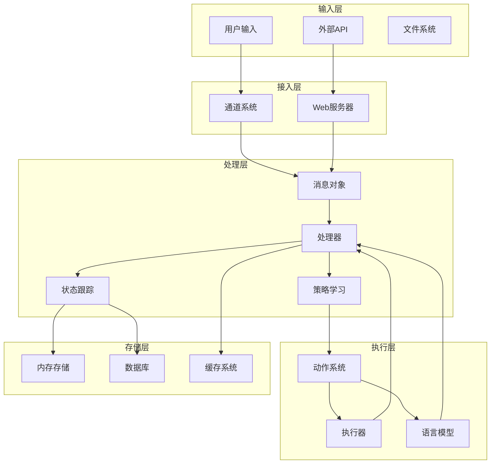

## 📨 消息处理流程

### 基础消息流

```mermaid
sequenceDiagram
    participant U as 用户
    participant C as 通道
    participant A as 智能体
    participant P as 处理器
    participant D as DST
    participant DPL as DPL
    participant Act as 动作
    participant L as LLM
    participant S as 存储
    
    U->>C: 发送消息
    Note over C: 消息格式转换
    C->>A: 转发Message对象
    A->>P: handle_message()
    
    Note over P: 构建UserUtter动作
    P->>D: get_tracker(session_id)
    S-->>D: 返回DST实例
    D-->>P: DST状态
    
    P->>D: update(UserUtter)
    Note over D: 更新对话状态
    
    P->>P: _handle_bot_actions()
    
    loop 动作执行循环
        P->>DPL: generate_actions(DST)
        DPL->>L: generate_chat() [if needed]
        L-->>DPL: LLM响应
        DPL-->>P: 动作列表
        
        P->>Act: run(agent, dst)
        Act->>L: 调用LLM [if needed]
        L-->>Act: 生成结果
        Act-->>P: 动作结果
        
        P->>D: update(动作)
        P->>C: send_response() [if BotUtter]
        
        alt 如果是BotUtter
            break 结束循环
        end
    end
    
    P->>S: save_tracker(DST)
    C-->>U: 返回响应
```

### 消息对象结构

```python
# 消息数据结构
class Message:
    def __init__(self):
        self.text: str          # 消息文本
        self.sender: str        # 发送者角色 (user/bot)
        self.sender_id: str     # 发送者ID
        self.receiver: str      # 接收者角色
        self.receiver_id: str   # 接收者ID
        self.session_id: str    # 会话ID
        self.metadata: Dict     # 元数据
        self.timestamp: datetime # 时间戳
```

### 数据转换过程

```mermaid
graph LR
    subgraph "输入转换"
        RawInput[原始输入] --> MessageFormat[消息格式化]
        MessageFormat --> Validation[数据验证]
        Validation --> MessageObj[Message对象]
    end
    
    subgraph "状态转换"
        MessageObj --> UserUtter[UserUtter动作]
        UserUtter --> StateUpdate[状态更新]
        StateUpdate --> DSTObj[DST对象]
    end
    
    subgraph "处理转换"
        DSTObj --> ActionGen[动作生成]
        ActionGen --> ActionExec[动作执行]
        ActionExec --> Result[执行结果]
    end
    
    subgraph "输出转换"
        Result --> ResponseFormat[响应格式化]
        ResponseFormat --> ChannelOutput[通道输出]
        ChannelOutput --> UserResponse[用户响应]
    end
```

## 🧠 智能决策数据流

### DPL策略决策流程

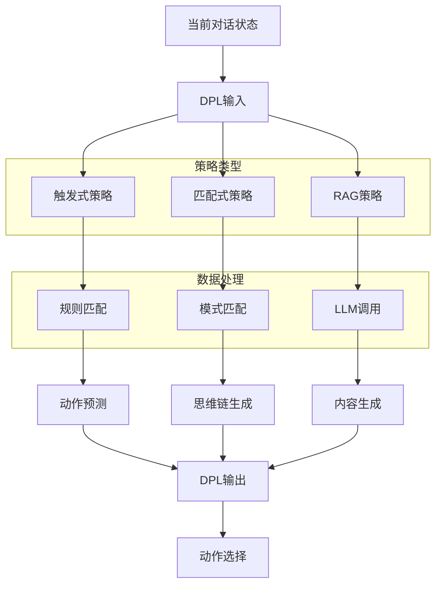

### 思维链生成流程

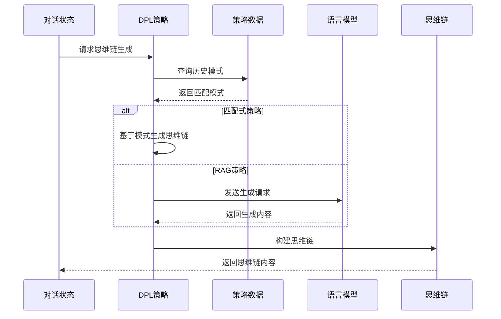

## ⚡ 动作执行数据流

### 动作生命周期

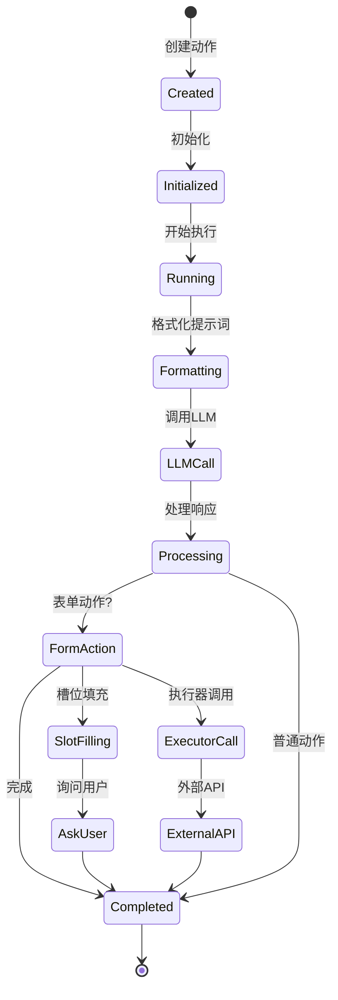

### 表单动作数据流

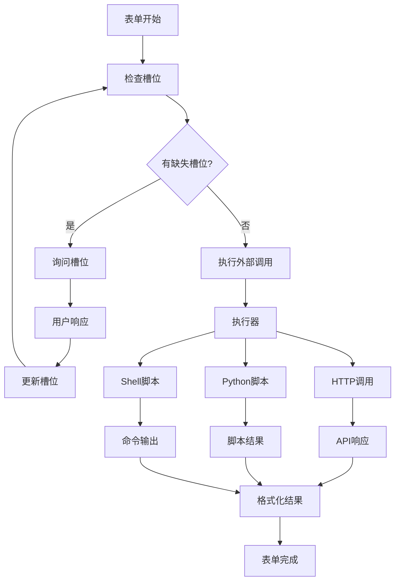

### 执行器数据流

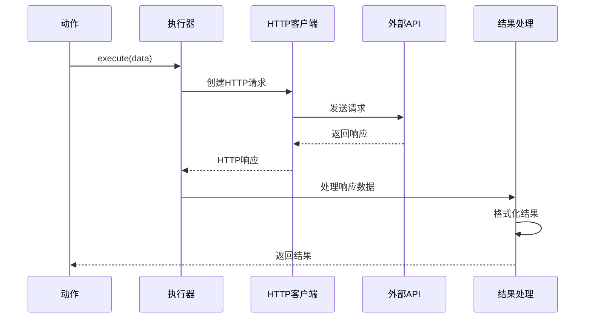

## 🗄️ 状态管理数据流

### DST状态更新

```mermaid
graph TD
    Action[动作执行] --> Apply[apply_to(DST)]
    Apply --> UpdateState[更新状态字段]
    
    UpdateState --> UpdateActions[更新动作队列]
    UpdateState --> UpdateSlots[更新槽位信息]
    UpdateState --> UpdateForm[更新当前表单]
    UpdateState --> UpdateLatest[更新最新信息]
    
    subgraph "状态字段"
        Actions[actions队列]
        FormlessActions[formless_actions队列]
        Slots[slots字典]
        CurrentForm[current_form]
        LatestAction[latest_action]
        LatestQuery[latest_query]
        LatestResponse[latest_response]
    end
    
    UpdateActions --> Actions
    UpdateActions --> FormlessActions
    UpdateSlots --> Slots
    UpdateForm --> CurrentForm
    UpdateLatest --> LatestAction
    UpdateLatest --> LatestQuery
    UpdateLatest --> LatestResponse
```

### 状态持久化

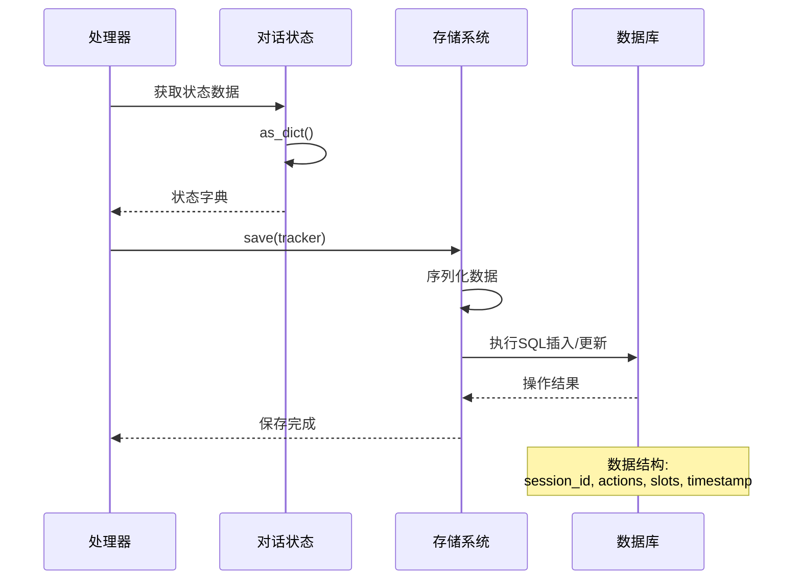

## 🔄 多智能体数据流

### Task任务编排

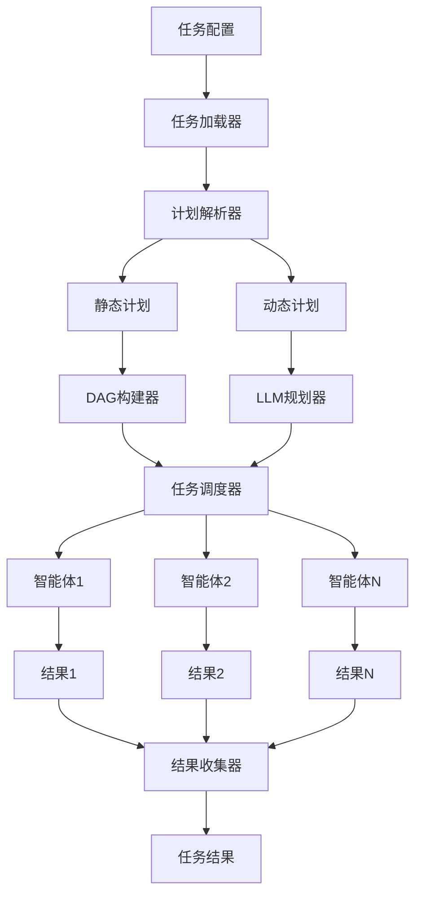

### 智能体间通信

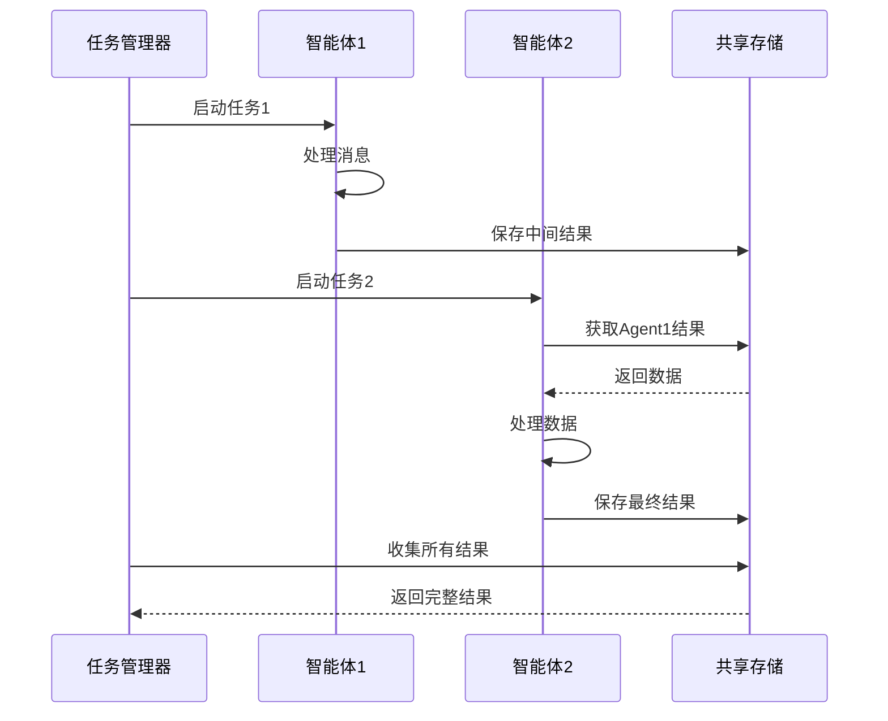

## 📊 数据格式和协议

### 标准数据格式

**1. 消息格式**
```json
{
  "type": "text",
  "sender": "user",
  "sender_id": "user_123",
  "receiver": "bot",
  "receiver_id": "bot_456",
  "session_id": "session_789",
  "text": "用户消息内容",
  "metadata": {
    "timestamp": "2024-01-01T00:00:00Z",
    "channel": "websocket"
  }
}
```

**2. 动作格式**
```json
{
  "name": "BotUtter",
  "description": "机器人回复",
  "timestamp": "2024-01-01T00:00:00Z",
  "result": [
    {
      "text": "机器人回复内容",
      "sender": "bot",
      "sender_id": "bot_456",
      "receiver": "user",
      "receiver_id": "user_123"
    }
  ]
}
```

**3. 状态格式**
```json
{
  "session_id": "session_789",
  "slots": {
    "city": "北京",
    "date": "今天"
  },
  "actions": [
    {
      "name": "UserUtter",
      "result": [{"text": "查询北京今天天气"}]
    },
    {
      "name": "BotUtter", 
      "result": [{"text": "北京今天晴天，25°C"}]
    }
  ]
}
```

### 通信协议

**1. WebSocket协议**
```javascript
// 客户端发送
{
  "event": "user_message",
  "data": {
    "text": "用户消息",
    "session_id": "session_123"
  }
}

// 服务端响应
{
  "event": "bot_response",
  "data": {
    "text": "机器人回复",
    "session_id": "session_123"
  }
}
```

**2. REST API协议**
```http
POST /api/chat
Content-Type: application/json

{
  "message": "用户消息",
  "session_id": "session_123",
  "user_id": "user_456"
}

HTTP/1.1 200 OK
Content-Type: application/json

{
  "response": "机器人回复",
  "session_id": "session_123",
  "timestamp": "2024-01-01T00:00:00Z"
}
```

## 🚀 性能优化

### 数据流优化策略

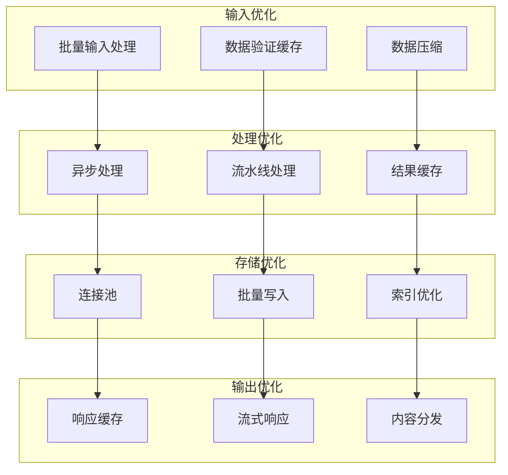

### 缓存策略

**1. 多层缓存**
- **L1 缓存**: 内存缓存 (最近访问的DST状态)
- **L2 缓存**: Redis缓存 (会话数据和LLM响应)
- **L3 缓存**: 数据库缓存 (持久化历史数据)

**2. 缓存失效策略**
- **TTL**: 时间过期自动失效
- **LRU**: 最近最少使用淘汰
- **版本号**: 数据更新时主动失效

### 并发控制

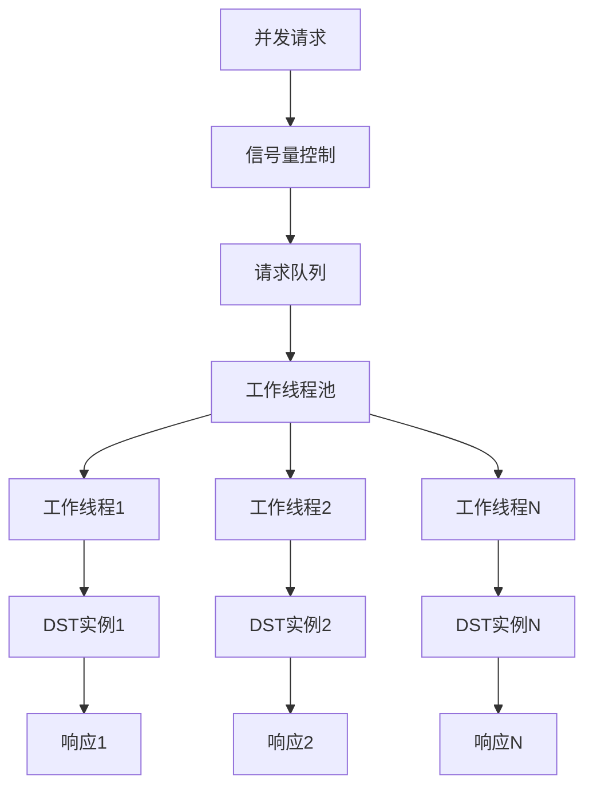

通过这种精心设计的数据流架构，COTA能够高效、可靠地处理复杂的对话场景，同时保证系统的可扩展性和可维护性。
