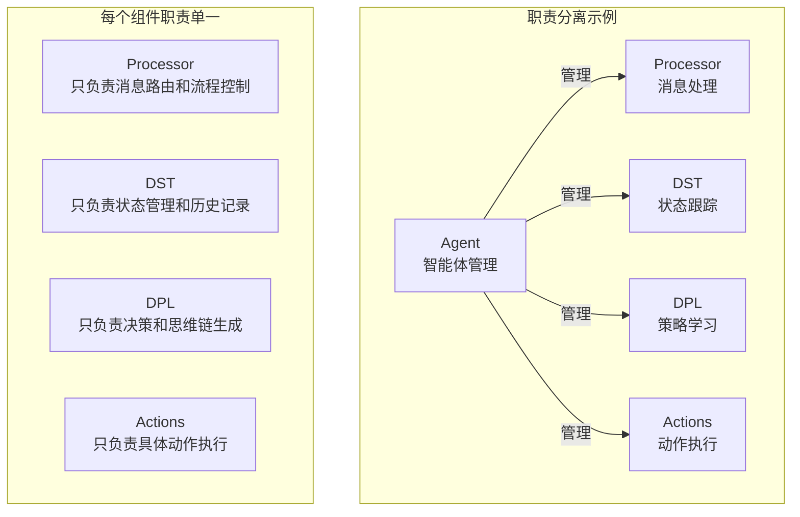
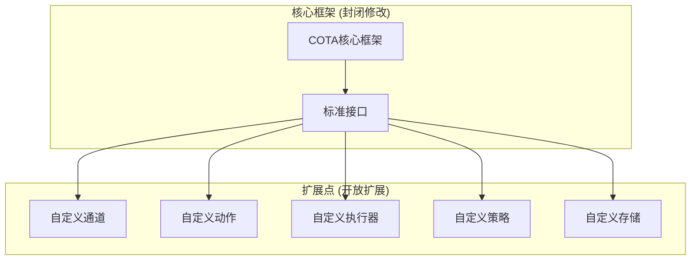
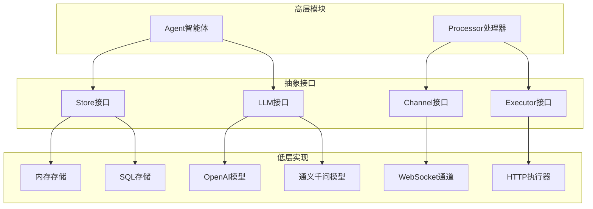
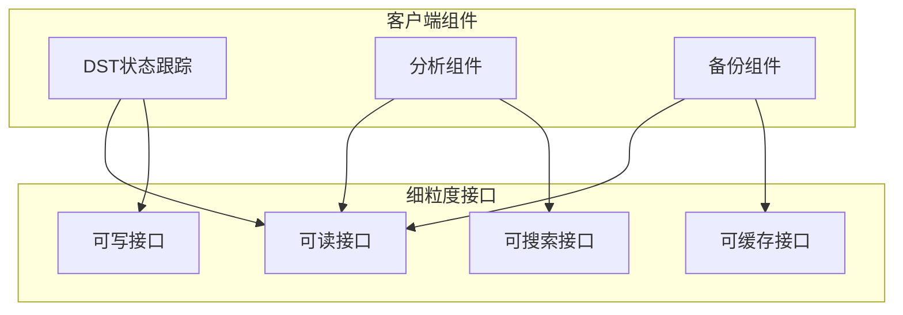
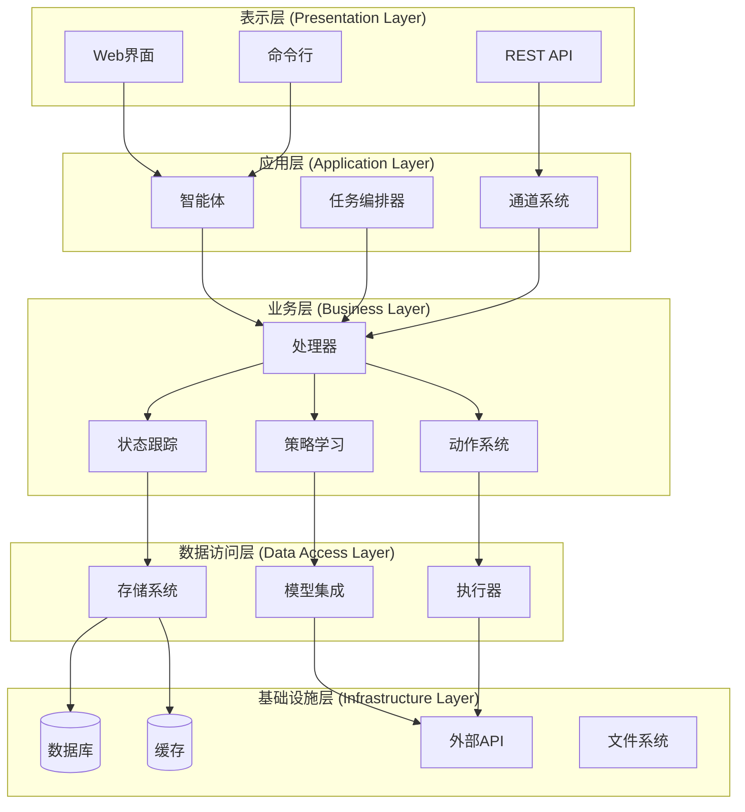
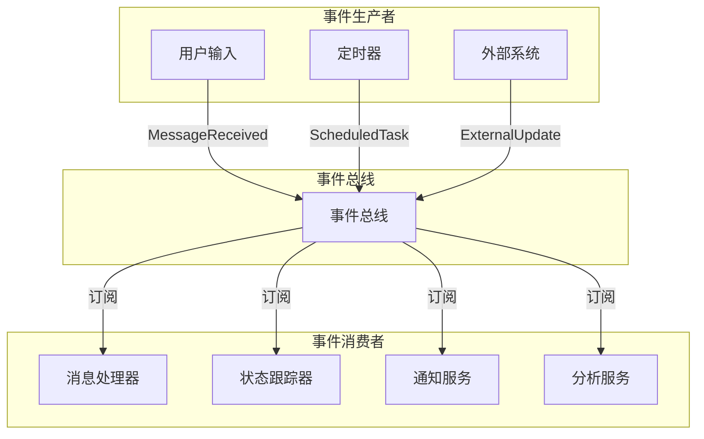
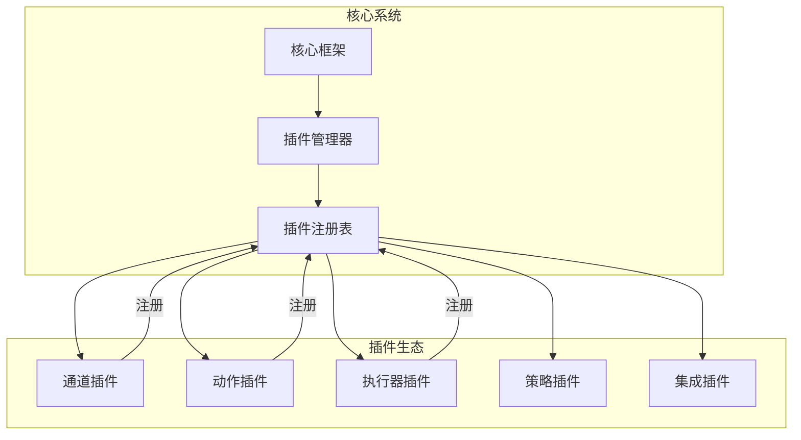
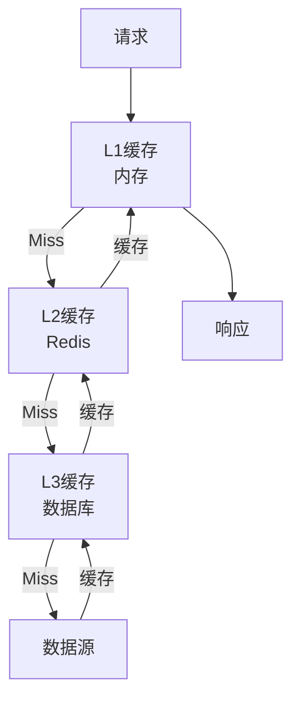

# 设计原则

COTA框架的架构设计遵循现代软件工程的最佳实践，以下是指导整个系统设计的核心原则和理念。

## 🎯 核心设计原则

### 1. 单一职责原则 (Single Responsibility Principle)

每个组件都有明确、单一的职责，避免功能耦合。



**实现体现**：
- **Agent**: 只负责组件整合和生命周期管理
- **Processor**: 只负责消息处理流程控制
- **DST**: 只负责对话状态跟踪和管理
- **DPL**: 只负责策略决策和思维链生成
- **Actions**: 只负责具体动作的执行

### 2. 开闭原则 (Open-Closed Principle)

系统对扩展开放，对修改封闭。通过插件化架构支持功能扩展。



**扩展示例**：
```python
# 自定义通道扩展
class CustomChannel(Channel):
    def blueprint(self, on_new_message):
        # 实现自定义通道逻辑
        pass

# 自定义动作扩展
class CustomAction(Action):
    async def run(self, agent, dst):
        # 实现自定义动作逻辑
        pass

# 自定义执行器扩展
class CustomExecutor(Executor):
    async def execute(self, data):
        # 实现自定义执行逻辑
        pass
```

### 3. 依赖倒置原则 (Dependency Inversion Principle)

高层模块不依赖低层模块，都依赖于抽象接口。



**实现体现**：
```python
# 抽象接口定义
class Store(ABC):
    @abstractmethod
    async def save(self, tracker: DST) -> None:
        pass
    
    @abstractmethod
    async def retrieve(self, session_id: str) -> Optional[List[Dict]]:
        pass

# 具体实现
class SQLStore(Store):
    async def save(self, tracker: DST) -> None:
        # SQL存储实现
        pass

class MemoryStore(Store):
    async def save(self, tracker: DST) -> None:
        # 内存存储实现
        pass
```

### 4. 接口隔离原则 (Interface Segregation Principle)

客户端不应该依赖它不需要的接口，接口应该小而专一。



**接口设计示例**：
```python
# 细粒度接口
class Readable(Protocol):
    async def read(self, key: str) -> Any:
        pass

class Writable(Protocol):
    async def write(self, key: str, value: Any) -> None:
        pass

class Searchable(Protocol):
    async def search(self, query: str) -> List[Any]:
        pass

# 组件只依赖需要的接口
class DST:
    def __init__(self, store: Readable & Writable):
        self.store = store
```

## 🏛️ 架构模式

### 1. 分层架构 (Layered Architecture)

系统按照功能和抽象层次分为多个层次，每层只与相邻层交互。



### 2. 事件驱动架构 (Event-Driven Architecture)

组件间通过事件进行松耦合通信，提高系统响应性和可扩展性。



**事件驱动实现**：
```python
# 事件定义
@dataclass
class Event:
    type: str
    data: Dict[str, Any]
    timestamp: datetime = field(default_factory=datetime.utcnow)

# 事件总线
class EventBus:
    def __init__(self):
        self._subscribers = defaultdict(list)
    
    def subscribe(self, event_type: str, handler: Callable):
        self._subscribers[event_type].append(handler)
    
    async def publish(self, event: Event):
        for handler in self._subscribers[event.type]:
            await handler(event)

# 使用示例
event_bus = EventBus()
event_bus.subscribe("message_received", handle_message)
await event_bus.publish(Event("message_received", {"message": msg}))
```

### 3. 插件架构 (Plugin Architecture)

通过插件机制实现功能的动态扩展和热插拔。



**插件实现示例**：
```python
# 插件基类
class Plugin(ABC):
    @property
    @abstractmethod
    def name(self) -> str:
        pass
    
    @abstractmethod
    async def initialize(self, config: Dict[str, Any]) -> None:
        pass
    
    @abstractmethod
    async def cleanup(self) -> None:
        pass

# 插件管理器
class PluginManager:
    def __init__(self):
        self._plugins = {}
    
    def register(self, plugin: Plugin):
        self._plugins[plugin.name] = plugin
    
    async def load_plugin(self, name: str, config: Dict[str, Any]):
        plugin = self._plugins.get(name)
        if plugin:
            await plugin.initialize(config)
```

## 🔧 设计模式应用

### 1. 工厂模式 (Factory Pattern)

用于创建不同类型的组件实例。

```python
# DPL工厂
class DPLFactory:
    @staticmethod
    def create(agent_config: Dict[str, Any], path: str) -> List[DPL]:
        dpl_list = []
        policies = agent_config.get("policies", [])
        
        for policy in policies:
            policy_name = policy.get('name')
            
            if policy_name == 'trigger':
                dpl_list.append(TriggerDPL(path=path))
            elif policy_name == 'match':
                dpl_list.append(MatchDPL(path=path))
            elif policy_name == 'rag':
                dpl_list.append(LLMDPL(path=path, llm=policy.get('llm')))
        
        return dpl_list

# 执行器工厂
class ExecutorFactory:
    @staticmethod
    def create(executor_type: str, config: Dict[str, Any]) -> Executor:
        executor_map = {
            "http": HttpExecutor,
            "python": PythonExecutor,
            "script": ScriptExecutor,
            "plugin": PluginExecutor
        }
        
        executor_class = executor_map.get(executor_type)
        if not executor_class:
            raise ValueError(f"Unknown executor type: {executor_type}")
        
        return executor_class(config)
```

### 2. 策略模式 (Strategy Pattern)

用于动态选择算法或行为。

```python
# 策略接口
class DPLStrategy(Protocol):
    async def generate_thoughts(self, dst: DST, action: Action) -> Optional[str]:
        pass
    
    async def generate_actions(self, dst: DST) -> Optional[List[str]]:
        pass

# 具体策略
class TriggerStrategy(DPLStrategy):
    async def generate_actions(self, dst: DST) -> List[str]:
        # 触发式策略实现
        pass

class RAGStrategy(DPLStrategy):
    async def generate_thoughts(self, dst: DST, action: Action) -> str:
        # RAG策略实现
        pass

# 策略上下文
class DPLContext:
    def __init__(self, strategies: List[DPLStrategy]):
        self.strategies = strategies
    
    async def execute_strategy(self, dst: DST, action: Action):
        for strategy in self.strategies:
            result = await strategy.generate_actions(dst)
            if result:
                return result
```

### 3. 观察者模式 (Observer Pattern)

用于状态变化的通知机制。

```python
# 观察者接口
class Observer(Protocol):
    async def update(self, event: Event) -> None:
        pass

# 被观察者
class DST:
    def __init__(self):
        self._observers = []
    
    def add_observer(self, observer: Observer):
        self._observers.append(observer)
    
    async def notify_observers(self, event: Event):
        for observer in self._observers:
            await observer.update(event)
    
    def update(self, action: Action):
        # 更新状态
        action.apply_to(self)
        # 通知观察者
        await self.notify_observers(Event("state_updated", {"action": action}))

# 具体观察者
class AnalyticsObserver:
    async def update(self, event: Event):
        if event.type == "state_updated":
            # 记录分析数据
            await self.record_analytics(event.data)
```

### 4. 责任链模式 (Chain of Responsibility)

用于请求处理的链式传递。

```python
# 处理器基类
class Handler(ABC):
    def __init__(self, next_handler: Optional['Handler'] = None):
        self._next_handler = next_handler
    
    @abstractmethod
    async def handle(self, request: Any) -> Optional[Any]:
        pass
    
    async def handle_next(self, request: Any) -> Optional[Any]:
        if self._next_handler:
            return await self._next_handler.handle(request)
        return None

# 具体处理器
class TriggerHandler(Handler):
    async def handle(self, request: DST) -> Optional[List[str]]:
        # 尝试触发式处理
        result = await self.trigger_process(request)
        if result:
            return result
        return await self.handle_next(request)

class MatchHandler(Handler):
    async def handle(self, request: DST) -> Optional[List[str]]:
        # 尝试匹配式处理
        result = await self.match_process(request)
        if result:
            return result
        return await self.handle_next(request)

# 构建责任链
trigger_handler = TriggerHandler()
match_handler = MatchHandler(trigger_handler)
rag_handler = RAGHandler(match_handler)
```

## 🚀 性能设计原则

### 1. 异步优先 (Async First)

所有I/O操作都采用异步方式，提高并发性能。

```python
# 异步设计示例
class AsyncProcessor:
    async def handle_message(self, message: Message):
        # 异步获取状态
        dst = await self.get_tracker(message.session_id)
        
        # 异步更新状态
        dst.update(action)
        
        # 异步处理动作
        actions = await self.generate_actions(dst)
        
        # 异步执行动作
        results = await asyncio.gather(*[
            action.run(self.agent, dst) for action in actions
        ])
        
        # 异步保存状态
        await self.save_tracker(dst)
```

### 2. 缓存策略 (Caching Strategy)

多层缓存提高数据访问性能。



### 3. 连接池 (Connection Pooling)

复用数据库和HTTP连接，减少连接开销。

```python
# 连接池配置
class ConnectionManager:
    def __init__(self):
        self.db_pool = create_pool(
            host='localhost',
            user='user',
            password='password',
            database='cota',
            minsize=5,
            maxsize=20
        )
        
        self.http_session = aiohttp.ClientSession(
            connector=aiohttp.TCPConnector(
                limit=100,
                limit_per_host=30
            )
        )
```

### 4. 懒加载 (Lazy Loading)

按需加载资源，减少启动时间和内存占用。

```python
class LazyAgent:
    def __init__(self, config_path: str):
        self.config_path = config_path
        self._agent = None
    
    @property
    def agent(self) -> Agent:
        if self._agent is None:
            self._agent = Agent.load_from_path(self.config_path)
        return self._agent
```

## 🔒 安全设计原则

### 1. 最小权限原则 (Principle of Least Privilege)

每个组件只拥有完成其功能所需的最小权限。

```python
# 权限控制示例
class SecureExecutor:
    def __init__(self, allowed_operations: Set[str]):
        self.allowed_operations = allowed_operations
    
    async def execute(self, operation: str, data: Dict[str, Any]):
        if operation not in self.allowed_operations:
            raise PermissionError(f"Operation {operation} not allowed")
        
        return await self._execute_operation(operation, data)
```

### 2. 输入验证 (Input Validation)

所有外部输入都必须经过严格验证。

```python
# 输入验证器
class MessageValidator:
    @staticmethod
    def validate(message: Dict[str, Any]) -> Message:
        # 验证必需字段
        required_fields = ['text', 'sender_id', 'session_id']
        for field in required_fields:
            if field not in message:
                raise ValidationError(f"Missing required field: {field}")
        
        # 验证数据类型
        if not isinstance(message['text'], str):
            raise ValidationError("Text must be string")
        
        # 验证数据长度
        if len(message['text']) > 10000:
            raise ValidationError("Text too long")
        
        return Message(**message)
```

### 3. 敏感信息保护 (Sensitive Data Protection)

敏感信息加密存储，使用环境变量管理密钥。

```python
# 敏感信息处理
class SecureConfig:
    @staticmethod
    def load_config(config_path: str) -> Dict[str, Any]:
        config = read_yaml_from_path(config_path)
        
        # 替换环境变量
        for key, value in config.items():
            if isinstance(value, str) and value.startswith('${') and value.endswith('}'):
                env_var = value[2:-1]
                config[key] = os.getenv(env_var)
                if config[key] is None:
                    raise ConfigError(f"Environment variable {env_var} not found")
        
        return config
```

## 🔄 可维护性原则

### 1. 代码可读性 (Code Readability)

代码应该清晰、易读、自文档化。

```python
# 清晰的命名和结构
class DialogueStateTracker:
    def __init__(self, session_id: str, agent: Agent):
        self.session_id = session_id
        self.agent = agent
        self.conversation_history = deque([])
        self.current_context = {}
    
    def add_user_message(self, message: str) -> None:
        """添加用户消息到对话历史"""
        user_action = self._create_user_action(message)
        self.conversation_history.append(user_action)
        self._update_context(user_action)
    
    def _create_user_action(self, message: str) -> Action:
        """创建用户动作对象"""
        return UserUtter(text=message, timestamp=datetime.utcnow())
```

### 2. 测试友好 (Test-Friendly)

设计应该便于单元测试和集成测试。

```python
# 依赖注入便于测试
class ProcessorTest(unittest.TestCase):
    def setUp(self):
        self.mock_store = MagicMock(spec=Store)
        self.mock_agent = MagicMock(spec=Agent)
        self.processor = Processor(agent=self.mock_agent, store=self.mock_store)
    
    async def test_handle_message(self):
        # 准备测试数据
        message = Message(text="test", session_id="test_session")
        
        # 模拟依赖
        self.mock_store.retrieve.return_value = None
        
        # 执行测试
        await self.processor.handle_message(message)
        
        # 验证结果
        self.mock_store.save.assert_called_once()
```

### 3. 错误处理 (Error Handling)

完善的错误处理和恢复机制。

```python
# 分层错误处理
class CotaException(Exception):
    """COTA基础异常"""
    pass

class ConfigurationError(CotaException):
    """配置错误"""
    pass

class ProcessingError(CotaException):
    """处理错误"""
    pass

class ExternalServiceError(CotaException):
    """外部服务错误"""
    pass

# 错误处理装饰器
def handle_errors(func):
    @wraps(func)
    async def wrapper(*args, **kwargs):
        try:
            return await func(*args, **kwargs)
        except ExternalServiceError as e:
            logger.error(f"External service error: {e}")
            # 降级处理
            return await fallback_handler(*args, **kwargs)
        except ProcessingError as e:
            logger.error(f"Processing error: {e}")
            raise
        except Exception as e:
            logger.error(f"Unexpected error: {e}")
            raise ProcessingError(f"Processing failed: {e}")
    
    return wrapper
```

这些设计原则共同构成了COTA框架的设计哲学，确保系统具有良好的可扩展性、可维护性、性能和安全性。
