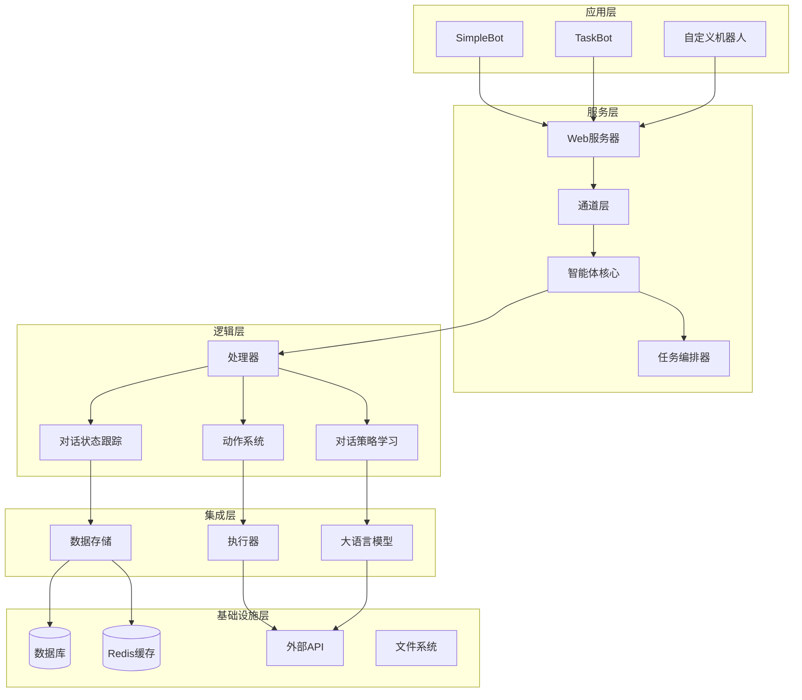
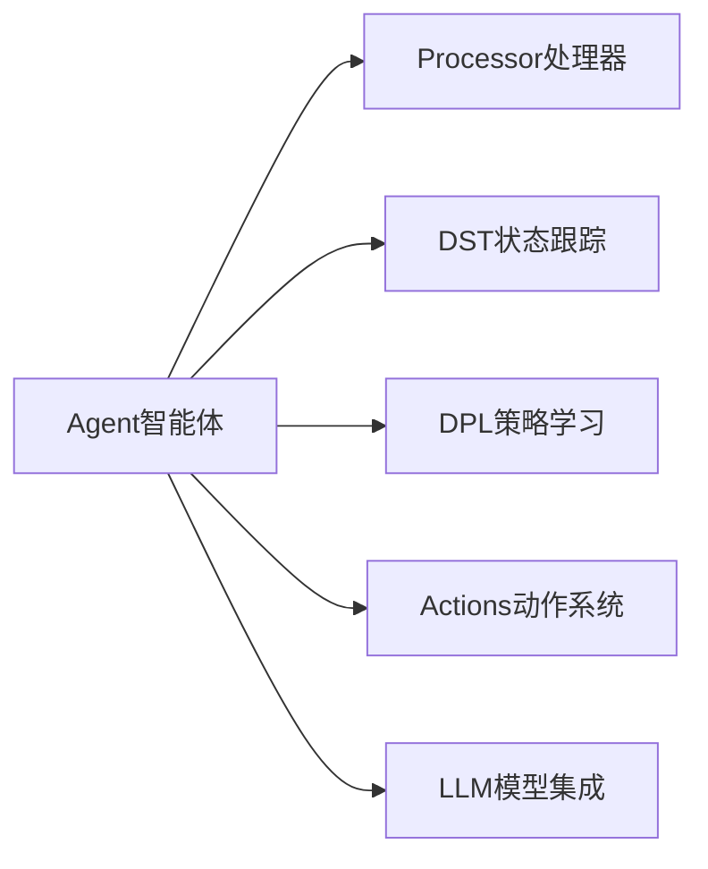
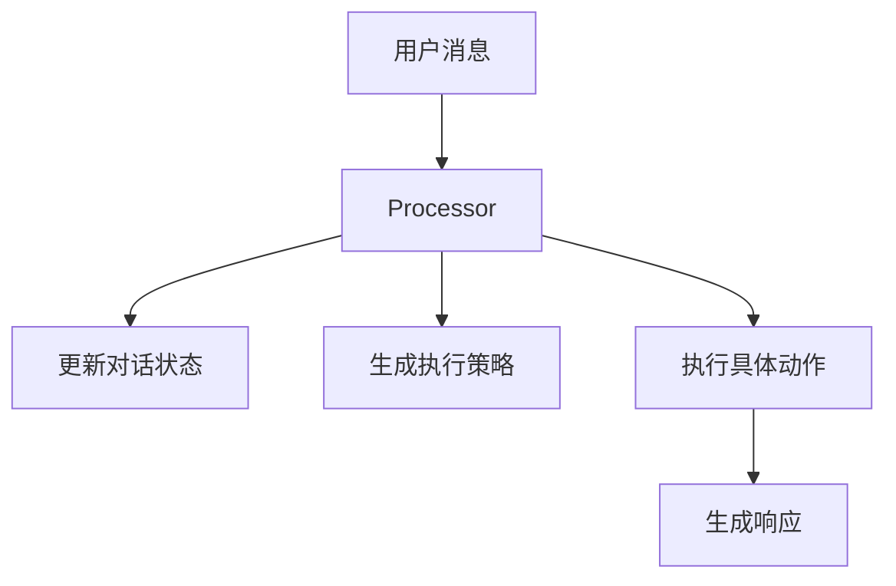
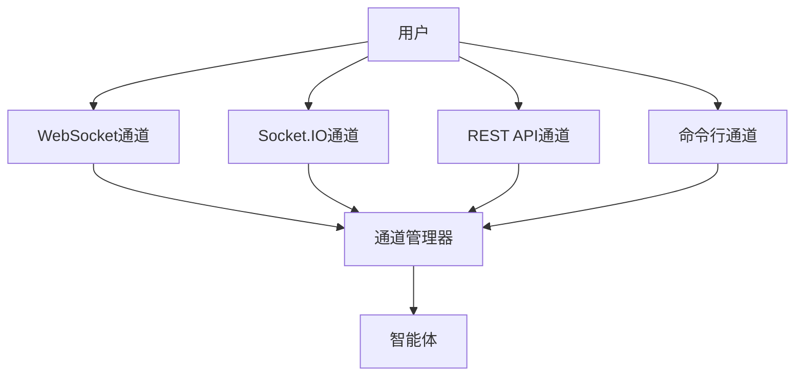
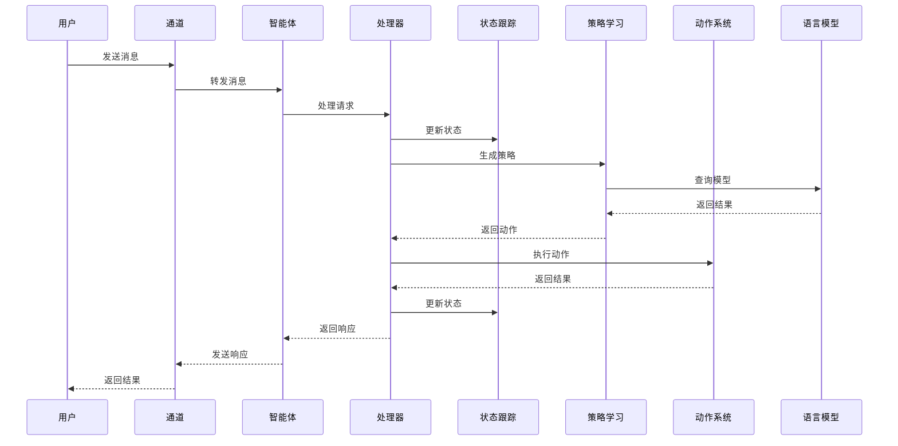
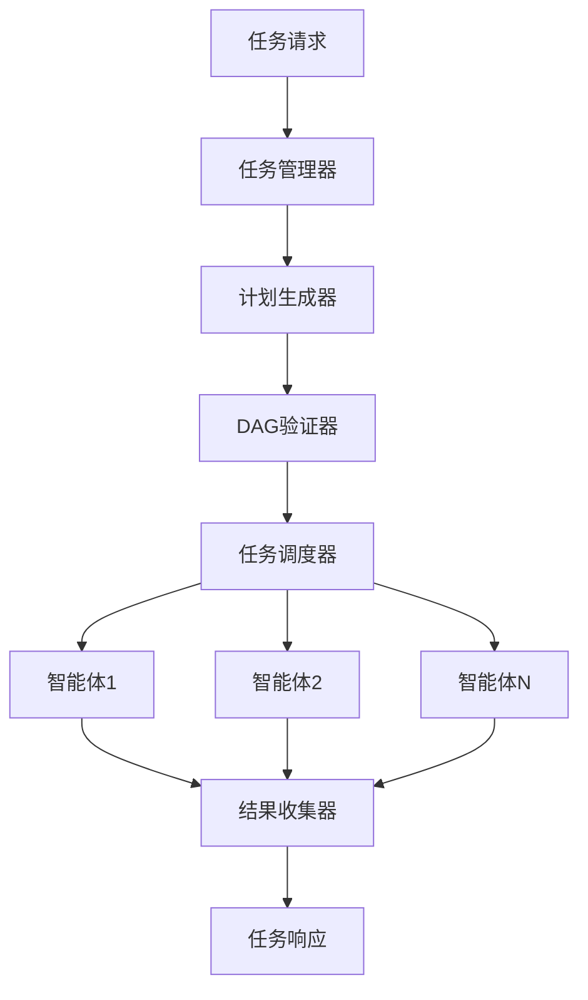

# COTA架构总览

COTA (COllaborative Task Agent) 是一个基于现代软件工程原则设计的生成式多对话平台。它采用了模块化、事件驱动、插件化的架构设计，旨在构建高性能、可扩展、易维护的智能对话系统。

## 🏗️ 整体架构

COTA采用分层架构设计，从底向上分为以下几层：

## 🎯 核心设计理念

### 1. **模块化设计 (Modularity)**
- 每个组件职责单一，边界清晰
- 组件间通过标准接口通信
- 支持独立开发、测试和部署

### 2. **事件驱动架构 (Event-Driven)**
- 基于消息和事件的异步处理
- 松耦合的组件交互
- 高并发和响应性能

### 3. **插件化扩展 (Plugin Architecture)**
- 支持自定义动作、通道、执行器
- 热插拔组件，无需重启服务
- 丰富的扩展点和钩子函数

### 4. **配置驱动 (Configuration-Driven)**
- 通过YAML配置定义行为
- 声明式的智能体定义
- 环境分离和配置管理

## 🔧 核心组件概览

### 智能体层 (Agent Layer)

**核心职责**：
- 智能体生命周期管理
- 组件协调和通信
- 配置解析和验证
- 资源管理和清理

### 处理层 (Processing Layer)

**核心职责**：
- 消息路由和处理
- 对话流程控制
- 错误处理和恢复
- 并发安全保证

### 通信层 (Communication Layer)

**核心职责**：
- 多通道接入支持
- 消息格式转换
- 连接管理和负载均衡
- 实时通信保证

## 📊 系统特性

### 1. **高性能 (High Performance)**
- 异步I/O处理
- 连接池和缓存机制
- 智能资源调度
- 并发控制和限流

### 2. **高可用 (High Availability)**
- 容错和故障恢复
- 健康检查和监控
- 优雅降级机制
- 分布式部署支持

### 3. **可扩展 (Scalability)**
- 水平扩展支持
- 微服务架构兼容
- 负载均衡和分片
- 弹性资源管理

### 4. **可观测 (Observability)**
- 结构化日志记录
- 指标监控和告警
- 分布式链路追踪
- 性能分析和优化

## 🔄 数据流概述

### 请求处理流程

### 任务编排流程

## 🔧 关键技术栈

### 后端框架
- **Sanic**: 高性能异步Web框架
- **AsyncIO**: Python异步编程支持
- **SQLAlchemy**: ORM和数据库抽象
- **Redis**: 缓存和会话存储

### AI/ML集成
- **OpenAI API**: GPT模型集成
- **Multiple LLM Support**: 多模型支持
- **Vector Database**: 向量数据库集成
- **RAG Pipeline**: 检索增强生成

### 通信协议
- **WebSocket**: 实时双向通信
- **Socket.IO**: 跨平台实时通信
- **HTTP/REST**: 标准API接口
- **Server-Sent Events**: 服务器推送

### 部署和监控
- **Docker**: 容器化部署
- **Kubernetes**: 容器编排
- **Prometheus**: 指标监控
- **Grafana**: 可视化监控

## 🚀 性能指标

### 吞吐量
- **单机QPS**: 1000+ 请求/秒
- **并发连接**: 10000+ 连接
- **响应时延**: < 200ms (P95)
- **内存使用**: < 512MB (基础配置)

### 可靠性
- **可用性**: 99.9%+
- **错误率**: < 0.1%
- **恢复时间**: < 30秒
- **数据一致性**: 强一致性

## 🔮 架构演进

### 当前版本 (v1.x)
- 单体应用架构
- 基础多智能体支持
- 核心功能完整

### 下一版本 (v2.x)
- 微服务架构迁移
- 云原生支持
- 高可用部署
- 性能优化

### 未来规划 (v3.x)
- 边缘计算支持
- 联邦学习集成
- 自适应扩缩容
- AI原生架构

## 📚 相关文档

- [核心组件详解](components.md) - 详细介绍各个组件的设计和实现
- [数据流设计](data-flow.md) - 深入分析数据在系统中的流转
- [设计原则](design-principles.md) - 架构设计背后的原则和考量

COTA的架构设计充分考虑了现代AI应用的特点和需求，在保证功能完整性的同时，注重性能、可扩展性和可维护性的平衡。
