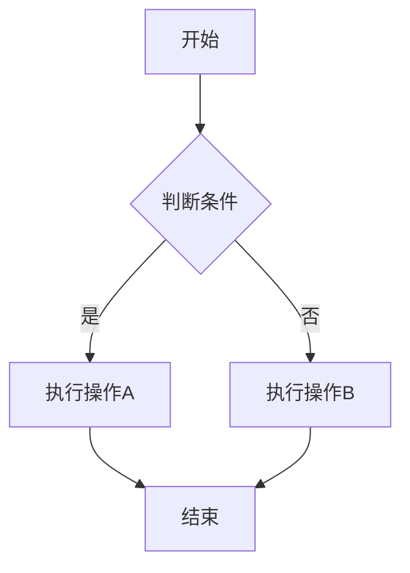
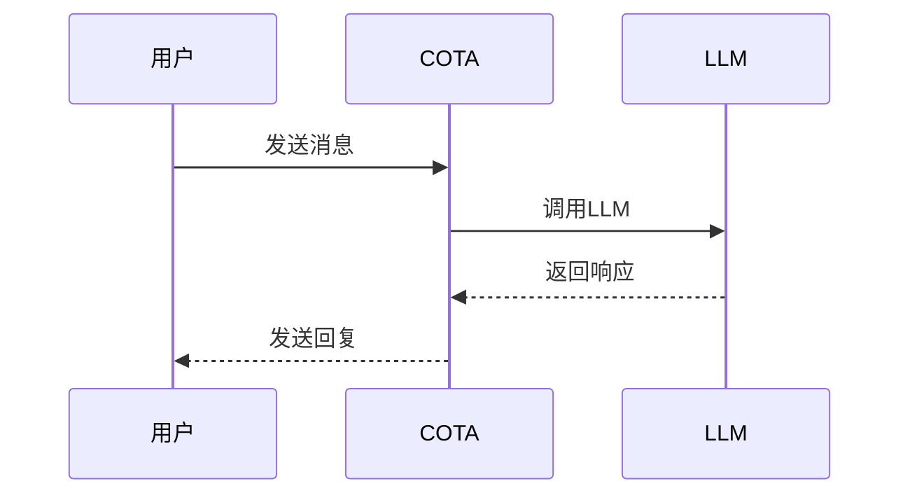
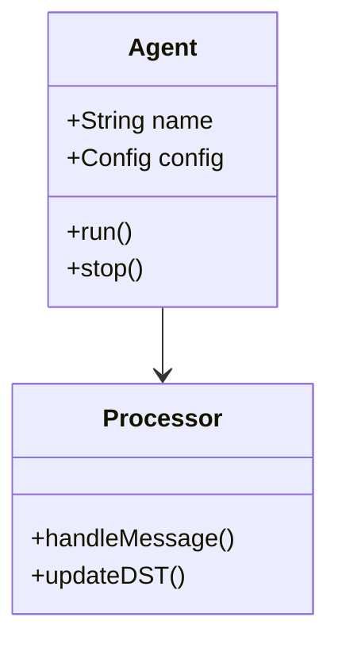

# Mermaid图表测试

这是一个测试页面，用于验证Mermaid图表是否能正常渲染。

## 流程图测试

```mermaid
graph TD
    A[开始] --> B{判断条件}
    B -->|是| C[执行操作A]
    B -->|否| D[执行操作B]
    C --> E[结束]
    D --> E[结束]
```

## 序列图测试

```mermaid
sequenceDiagram
    participant U as 用户
    participant C as COTA
    participant L as LLM
    
    U->>C: 发送消息
    C->>L: 调用LLM
    L-->>C: 返回响应
    C-->>U: 发送回复
```

## 类图测试

```mermaid
classDiagram
    class Agent {
        +String name
        +Config config
        +run()
        +stop()
    }
    
    class Processor {
        +handleMessage()
        +updateDST()
    }
    
    Agent --> Processor
```

如果以上图表都能正常显示为图形而不是代码，说明Mermaid配置成功！
